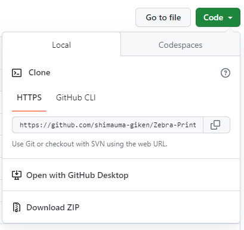
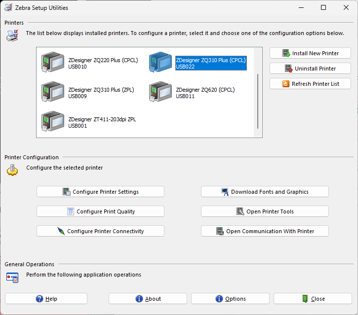
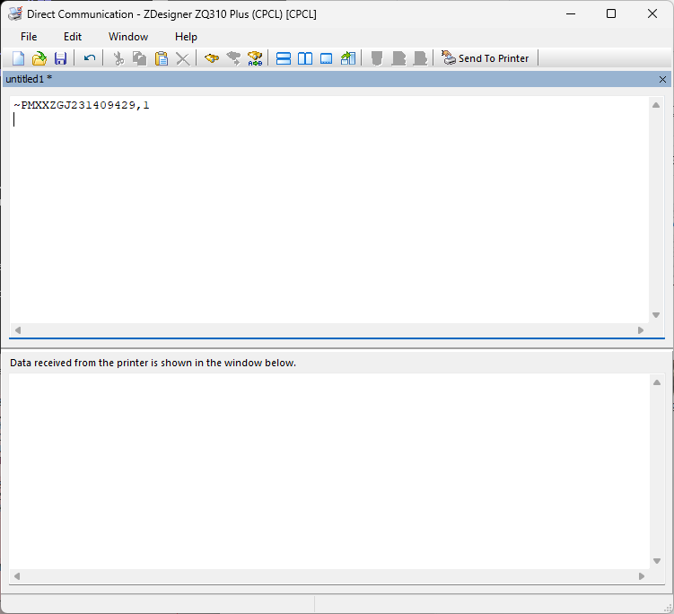
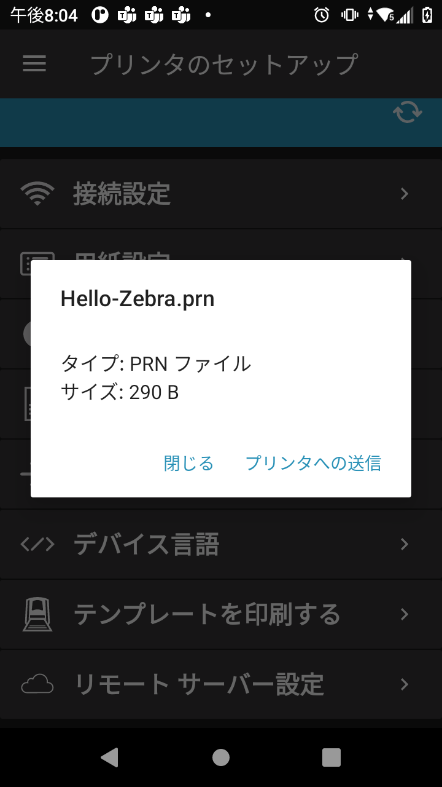
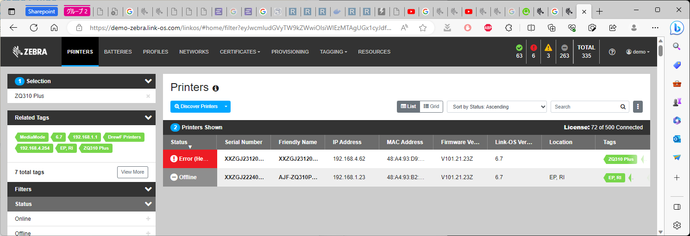

# Zebra-Printer_ZQ300plus_Demo_Guide
 ZQ300+ デモガイド（簡易版）

---

<!-- paginate: true
_color: white
-->

***ZQ3+ Demo Guide for Sales***

#### 28 Aug 2023

  

---

**Agenda**
 

| デモ | Link-OS ソリューション|
|-|-|
| ラベル作成デモ | ZDesighner 3
| デモ印刷      | ZebraSetup + Print Touch
| EMMの紹介   | PPME
| Staging Tool  | Mirror
| PDF ダイレクト印刷  | PDF Direct

  

---

***用意するもの***

- ZQ300+ 
- USB C ケーブル、 ZQ3+/TC/ET共通
- ZQ3+ラベル（用黒マーク推奨）
- TC or ET 端末、 A11 以上
  - Zebra Setup Utilities for Android
- パソコン、 Win10 以上
  - Zebra Setup utlities for Windows
  - Zebra Designer 3 Essential or Pro
  - ZDriver for Windows

  
---

*** デモ甩ファイルのダウンロード方法 ***

1. Code ボタンを選択。
1. Download zipを選択。

  
1. ダウンロードしたzipを解答する。
1. デモ用のファイルは全てDemo-Materials-ZQ3pフォルダに入っています。

---

*** ZQ300+ の初期化***

1. ZQ300とPCをUSBケーブルで接続する。
1. Zebra Setup for Windows を起動する。
1. Printers にて、接続中のプリンタを選択する。
  

1. [Open Communication with Printer]を選択する。
1. 下記コマンドを入力する。  

        ~PM[プリンタのシリアル番号],1

    ▼ 例、S/N XXZGJ231409429の場合
  

1. プリンタが再起動する。
1. 起動したら初期化完了。

  

---

***前準備作業 (ZQ300+ Wi-Fi)***

1. 新橋オフィスで作業をすること。
2. ラベルを入れる。
3. PCとプリンタを接続し、プリンタを起動する。
4. ZQ3+ 設定ファイルをZSUを用いてプリンタに送付する。(ZQ3-mark-wf-Zatar.zpl)
5. プリンタは即座に再起動。再起動後にNWに接続することを確認。
6. 再度プリンタがフィード＋再起動するまで待つ。（5分程度）
7. デモの準備環境

※ Zebra Mirror（簡易EMM）でファーム更新、フォントインストール、設定を実施している。10分経過しても処理が完了しない場合は上記初期化手順を実施すること。

  

---

***前準備作業 (ZQ300+ Bluetooth)***

1. ラベルを入れる。
2. PCとプリンタを接続し、プリンタを起動する。
3. ZQ3+ 設定ファイルをZSUを用いてプリンタに送付する。(ZQ3-mark-bt.zpl)
4. キャリブレーション後にプリンタは即座に再起動。
5. デモの準備環境

  

---

***Android端末からのデモ印刷***

1. ZDesigner 3 で任意のラベルを作成。prnファイルとして保存。
2. ZPLファイルをAndroid端末内のDownloads下に保存。
4. Android端末をZQ3+とペアリングする。
5. 接続アプリを聞かれた場合はPrinter Setup を選択する。
6. [使用可能なファイル] > Downloads フォルダ > ZPLファイルを選択 > [プリンタへ送信]
7. ラベル印刷

 

※[テンプレートの印刷]によるデモ印刷も可。

  

---

  

***PDF Direct***

 

1. 印刷用PDFファイルをAndroid端末内のDownloads下に保存。
2. Android端末上でZebra Setup Utilites を起動
3. [デバイス言語] >[デバイス言語を設定] > [PDF] > [適用]
4. プリンタが再起動する。
5. [使用可能なファイル] > Downloads フォルダ > PDFファイルを選択 > [プリンタへ送信]
6. ラベル印刷

※PDF Directが未Activationの場合は下記を参考にActivate。

[PDF Direct Activation](https://supportcommunity.zebra.com/s/article/PDF-Direct-Activation?language=en_US)

  

---

***Printer MDM /PPME のデモ(ZQ300+ Wi-Fi)***

1. PPME へ接続する。
    <https://demo-zebra.link-os.com/linkos/>  
    User name: demo　/  Password: Password1&  

2. PPME上にプリンタは登録済みなので、エラー通知、Tagグループ化、遠隔操作などのデモをする。  
   

PPME Demo Guide  
<https://techdocs.zebra.com/link-os/latest/demos/ppme/>

  

---

***参考資料***

ZebraDesigner3 Essential_紹介資料_20210915.pptx
ZebraDesigner3 Professional_紹介資料_20220520.pptx
Print-DNA_PPME_v20230308.pptx
ZQ2-3-6 Plusまとめ紹介資料 - 20221026.pptx
Print-DNA_PDF Direct_紹介_ハンズオン_20221114.pptx
[PDF Direct Activation](https://supportcommunity.zebra.com/s/article/PDF-Direct-Activation?language=en_US)

  

---

<!-- paginate: true
_color: white
-->

### Enjoy your Demo!!

